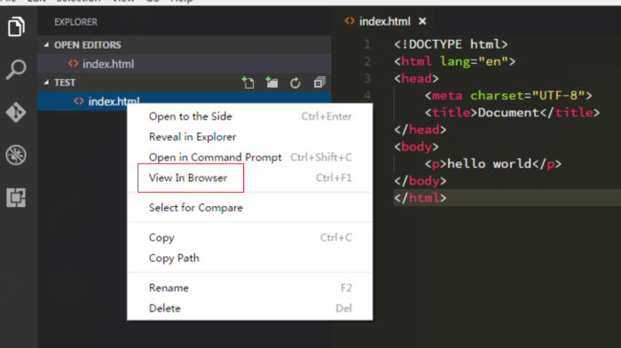

## View In Browser
Extension for vscode to view a html file in a browser. 
## Usage 
Use command or context menu in the explorer.

### Command

    1. Open the command list (Press F1 or Ctrl + Shift + P)
    2. Select `View In Browser`
### Keybindings

    1. Press Ctrl + F1

### Context Menu

    

## Configuration
You can select what browser you want to open html file with. Default value is your default browser.
Add to User or Workspace settings:
``` 
{
    "view-in-browser.customBrowser": "chrome"
}
```

### Supported OS
    Windows, Linux, MacOS
### Supported browsers
Supported browsers by [node-open](https://github.com/pwnall/node-open). 
```
Mozilla, Chrome, Internet Explorer, Safari
```